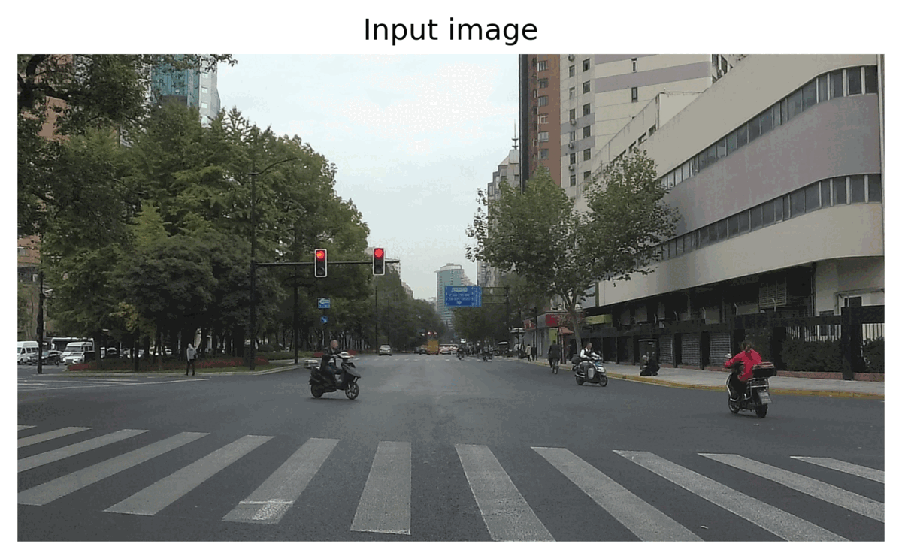

# Detectron2-STAC-SODA10m

## Introduction
Welcome to the Detectron2-STAC-SODA10m repository. This project integrates the STAC semi-supervised object detection algorithm with Detectron2 applied to the SODA10m dataset. The STAC algorithm, which stands for **S**elf-**T**raining (via pseudolabel) and **A**ugmentation driven **C**onsistency regularization. Used to improve object detection performance, particularly in situations where labeled data is not abundantly available.

## Objectives
The primary goal of this repository is to develop and implement the Self-Training and Augmentation driven Consistency regularization (STAC) approach using the Detectron2 library. With a focus on the SODA10m dataset, this project aims to:
- Enhance object detection models using semi-supervised learning.
- Minimize the dependency on extensive labeled datasets while maintaining high model performance.

## Features
- **Preprocessing Scripts**: Prepare your images from the SODA10m dataset for object detection tasks.
- **Model Training Notebooks**: Step-by-step Jupyter notebooks to train your object detection model using Detectron2 with STAC.
- **Inference and Evaluation**: Tools to evaluate the model performance and visualize the detection results.


## Demo
To illustrate the functionality of the repository, here is a GIF showcasing the pre-processing, training, and detection steps:



_The GIF is a composite of two images that demonstrate the before-and-after effect of applying Faster RCNN._

## Getting Started

To begin working with this project, follow these steps:

1. **Clone the Repository:**
   - Start by cloning this repository to your local machine. Use the command `git clone [repository URL]`.

2. **Install Python or Anaconda:**
   - This project was developed using Python 3.8. 

3. **Set Up a Python Environment:**
   - It's recommended to create a virtual environment to manage dependencies. 

4. **Install Dependencies:**
   - Install the necessary packages using the `requirements.txt` file: `pip install -r requirements.txt`. This file includes specific versions of libraries that are known to work with this project.

5. **Note on Package Versions:**
   - While you are free to use the latest versions of the dependencies, it is important to note that this project was developed and tested with the versions listed in `requirements.txt`. If you encounter any issues with newer versions, revert to the versions specified in the file.

6. **Setup Dataset:**
   - Ensure you have the SODA10m dataset downloaded and organized in the following structure within the project directory:
     ```
     / (root of the Git repository)
     └── SSLAD-2D/
         └── labeled/
             ├── annotations/
             ├── test/
             ├── train/
             └── val/
     ```

By following these steps, you should be able to set up the project environment and start working with the STAC implementation using the Detectron2 library and the SODA10m dataset.


## Contributions
Contributions to this repository are welcome. Please submit a pull request or open an issue if you have suggestions or improvements.

## License
This project is open-sourced under the MIT license. See the LICENSE file for details.

